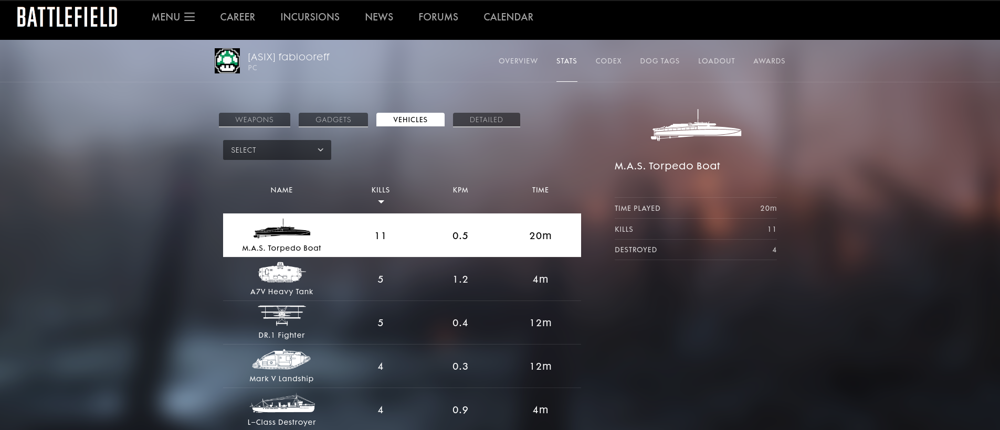

# Projecte-Battlebot-Java
### The purpose of this repository, is create a Java Bot for Telegram Desktop.
### The objective of this bot is show Battlefield 1 Game stadistics, of selected player.

#### When player demand info the bot pass the info will go through Battlefield Companion App
#### Battlefield Companion is a official DICE App for consulting player stadistics of the game. 

#### Among the functions of the bot they are consulting the different statistics, weapons, vehicles, details and gadgets!

#### One of the functionalities is to show Battlefield page news, i do it with the command /battlefieldnews.
#### It also has the functionality of /myname and /myfullname, which returns your name or your full name in Telegram, it is stupid but it helps to understand a bit the commands of Telegram.

