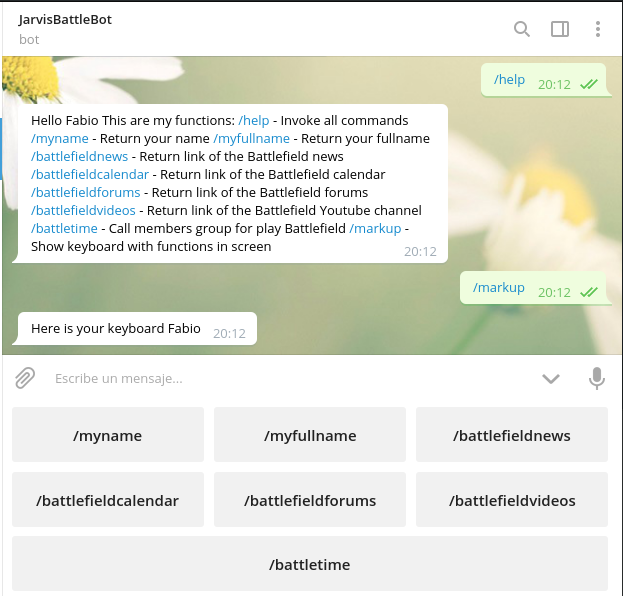

# Projecte-Battlebot-Java

#### The objective of this bot is offer news about battlefield in my Telegram friends group, and also give more expirience with Telegram bots.

#### This bot has basic functions to show specific links of the Battlefield page, which you can touch in the screen keyboard.

# Dependences 
#### Necessary dependencies for import Telegram API methods. Remember to make the following imports in the code:

##### org.telegram.telegrambots.api.objects.replykeyboard.ReplyKeyboardMarkup
##### org.telegram.telegrambots.api.objects.replykeyboard.buttons.KeyboardRow
##### org.telegram.telegrambots.api.methods.send.SendMessage
##### org.telegram.telegrambots.api.objects.Update
##### org.telegram.telegrambots.bots.TelegramLongPollingBot
##### org.telegram.telegrambots.exceptions.TelegramApiException
##### java.util.ArrayList
##### java.util.List

# Execute 
#### When /help is executed the bot returns message with information of the bot functions.

